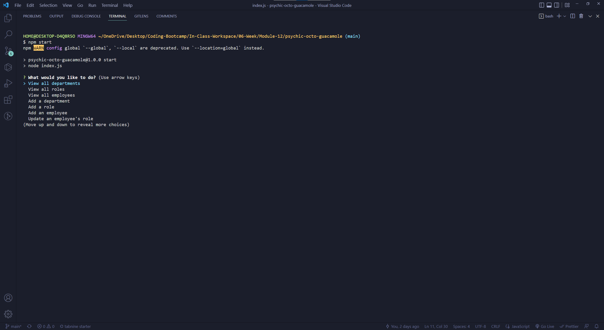
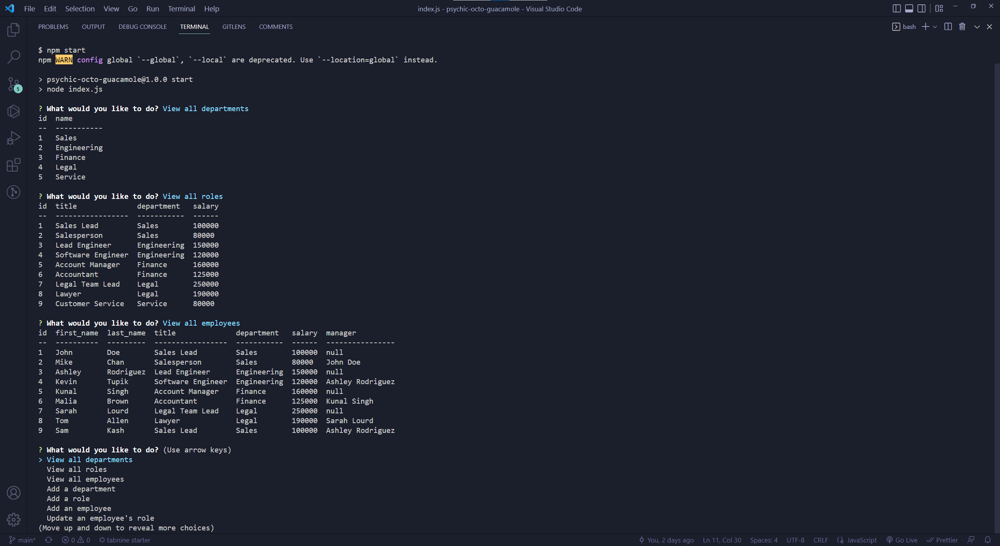

# Employee Tracker
  
## Description

This project uses mysql database to store and change employee data through command line prompts.

## Table of Contents

- [Installation](#installation)
- [Usage](#usage)
- [License](#license)
- [Contributing](#contributing)
- [Tests](#tests)
- [Questions](#questions)

## Installation

After cloning the repo down onto your local machine, type "npm install" in terminal.

## Usage

After following the installation instruction, type "npm start" in terminal.

See demo video: https://drive.google.com/file/d/1nwaWr5-8AE6jFGRtr5vNk5z6di7jAYZo/view

## Contributing

N/A

## Tests

N/A

## Questions

If you have any questions, you can email me at williamliao1998@gmail.com. Or see https://github.com/WilliamL1998.